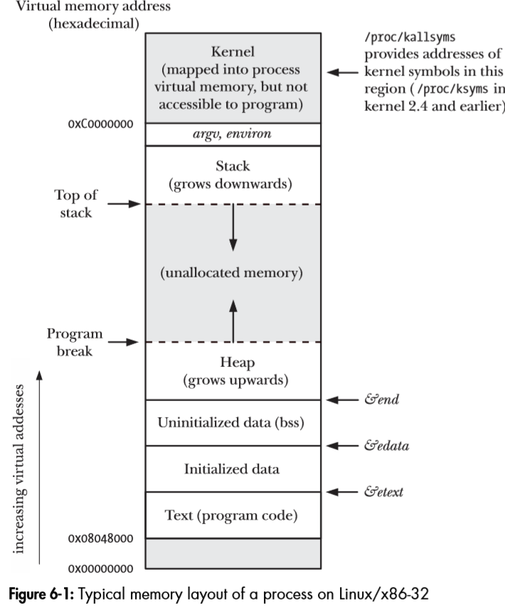
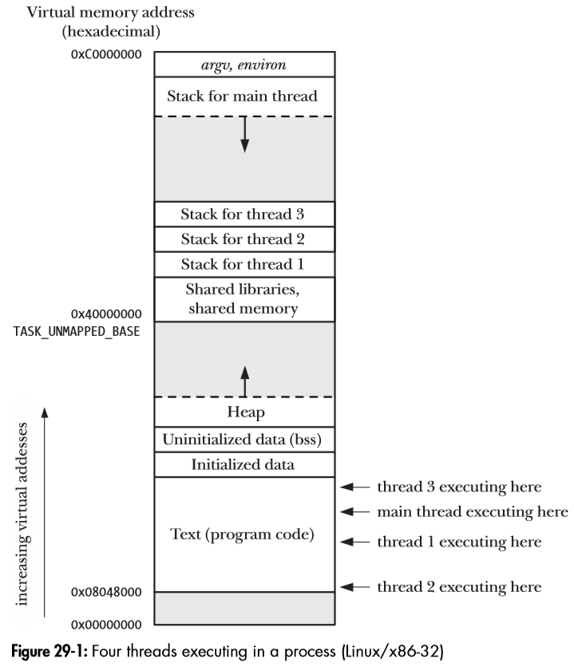

# 内存管理
>## 虚拟内存（Virtual Memory）
>操作系统为每个进程虚拟化出独立的逻辑地址空间，这个空间大小与操作系统位数有关（如：2^32bytes或2^64bytes）
>### 分页（Page）
>操作系统将内存划分为固定大小的页，分配内存时按页分配。
>* 页表（Page Table）  
>操作系统将物理内存划分为多个页框（Page Frame）每个页框有自己的页框号（Page Frame Number）页框内为一片连续存储的内存。    
>操作系统将每个进程的虚拟内存地址划分为两部分：高位为虚拟页号（VPN）低位为在虚拟页中的偏移（Offset）  
>每个进程都有自己的页表（Page Table），页表由页表入口（Page Table Entry）组成，PTE不仅包含VPN与PFN的对应关系，还有一些功能位分别表示这个页是否时可读的（protection bit）、是否是有效的（valid bit）、是否被更改过（dirty bit）、对应的数据是在硬盘还是在内存中（present bit） 等等。  
>当进程用虚拟内存地址访问内存时，硬件中的内存管理单元（MMU）将VPN翻译为PFN,offset不变。由于虚拟内存并不完全对应物理内存，一部分虚拟内存可能对应在磁盘空间上。当访问的虚拟内存地址不再物理内存上时，将发生缺页中断，此时会将数据从硬盘加载到物理内存当中。
>* 快表(Translation-Lookaside-Buffer)  
>如果每次访问内存都需要MMU将虚拟内存转化为物理内存，会一定程度上影响效率。所以引入TLB这个概念，TLB是MMU的一部分，功能可以理解为内存地址翻译的cache。每当MMU进行地址翻译的时候先查找TLB中是否有VPN-PFN对应关系，如果TLB中没有这个对应关系再去页表中查找对应关系并对TLB进行替换。
>* 多级页表  
>如果每个页框中包含的内存较多，那么就更容易造成内存碎片。如果包含的内存较小，那么就需要更多的VPN-PFN对应关系也就需要更大的页表。我们假设在一个32位系统中，每个页的大小为4KB，则offset为12位VPN为20位，每个PTE为4字节，那么每个进程便需要4MB大小的页表，如果系统运行100个进程，那么仅仅为了内存翻译就需要400MB！  
>多级页表可以说是由增加时间复杂度降低空间复杂度的思想而来。简单来说我们将VPN进行划分，高位VPN对应高级页表，地位VPN对应低级页表，高级页表中包含低级页表位置的对应关系，最低级的页表包含PFN的对应关系。
>* 替换算法
>   * FIFO（First In First Out）：  
>   页被存放在队列当中，每次加入新页都将其置于队头，当需要替换时将队尾的页淘汰掉（即最先进入的页）。
>   * LRU（Least Recently Used）：  
>   页被存放在链表中，每次加入新页都将其置于链头，每当页命中时将命中页插入链头，当需要替换时将链尾的页淘汰掉（即最近一段时间访问次数最少的页）。  
>   * LFU（Least Frequently Used）：  
>   记录每个页的命中次数，当需要替换时将命中次数最少的页淘汰掉（即访问次数最少的页）。  
>   * Clock算法：  
>   页被存放在环形链表中，链表中有一个指针指向页，每当页命中时将页的引用位（reference bit）置为1（默认为0），当需要替换时如果指针指向的页引用位为0将此页替换并将指针前移，如果指向的页引用位为1便将引用位设为0并前移指针。
>###  分段（Segment）
>分配内存时操作系统根据请求的大小，在合适的位置划分出一块制定大小连续的内存段。
>* 段表（Segment Table）
>段表内包含所有被分配的段，每个段有两部分组成：基础地址（Base Address）表示这个段的起始物理地址，界（Bound）表示这个段的长度。  
>操作系统将每个进程的虚拟内存地址划分为两部分：高位为段号（Segment Number）低位为在段中的偏移（Offset）。  
>当进程用虚拟内存地址访问内存时，根据段号在段表中找到相应的段，物理内存地址为此段的基础地址+偏移。  
>* 分配策略  
>当当内存经过多次分配与释放后，空闲内存被各个内存段所隔离开，这就是外部内存碎片。为了减少内存碎片我们需要使用合适的分配策略。
>   * 最佳适应法（Best Fit）  
>   遍历整个空闲内存表，找到满足分配需求的最小空闲内存块。  
>   特点：每次分配给文件的都是最合适该文件大小的分区。  
>   缺点：内存中留下许多难以利用的小的空闲区。  
>   * 最差适应法（Worst Fit）  
>   遍历整个空闲内存表，找到内存表中最大的空闲内存块。  
>   特点：给文件分配分区后剩下的空闲区不至于太小，产生碎片的几率最小。  
>   缺点：使存储器中缺乏大的空闲区，对大型文件的分区分配不利。  
>   * 首次适应法（First Fit）  
>   从空闲内存表的首位按顺序查找，找到第一个能满足分配需求的空闲内存块。  
>   优点：该算法倾向于使用内存中低地址部分的空闲区，从而保留了高地址部分的大空闲区，为之后的大块分配请求创造条件。  
>   缺点：低地址部分不断被划分，留下许多难以利用、很小的空闲区，而每次查找又都从低地址部分开始，会增加查找的开销。  
>   * 循环首次适应法（Next Fit）   
>   从上一次分配内存的位置开始按顺序查找，找到第一个能满足分配需求的空闲内存块。  
>   特点：使内存中的空闲分区分布的更为均匀，减少了查找时的系统开销。  
>   缺点：缺乏大的空闲分区，从而导致不能装入大型作业。  
>   * 分离链表（Segregated List）  
>   由于每次分配时都要对空闲列表进行遍历，如果分配请求的大小比较固定，那么就可以从空闲列表中分离出一部分。那么特殊大小的分配请求就可以从分离链表中遍历，从而减小遍历时的开销。  
>   * Buddy分配  
>## Linux内存分配API  
>`int brk(void *addr)`  
>brk()将进程的program break改变为参数addr指定的位置，成功时返回0，失败时返回-1。    
>`void *sbrk(intptr_t increment)`  
>sbrk()将program break的值加上increment(有符号整数)作为新的program break，并返回原先的program break值。  
>`void *mmap(void *addr, size_t length, int prot, int flags, int fd, off_t offset)`  
>mmap()可以将一个文件映射到进程的虚拟内存空间上，文件被映射到进程地址空间后，进程可以向访问普通内存一样对文件进行访问，不必再调用read()、write()。mmap有两大作用，一是改变文件的IO方式一定程度上降低开销，二是实现内存共享。  
>addr：映射区的开始地址，设置为0时表示由系统决定映射区的起始地址。  
>length：映射区的长度。  
>prot：期望的内存保护标志，如PROT_EXEC、PROT_READ、PROT_WRITE、PROT_NONE。  
>flags：指定映射对象的类型。  
>fd：文件描述符。一般是由open()函数返回，其值也可以设置为-1，此时需要指定flags参数中的MAP_ANONYMOUS,表明进行的是匿名映射。  
>offset：被映射对象内容的起点。  
>成功时，mmap()返回映射区的指针,失败时返回-1（MAP_FAILED）  
>`int munmap(void *addr, size_t length)`  
>进程调用munmap()解除一个该进程虚拟内存空间上的一个映射关系，addr指向映射区（即mmap返回的指针），length为映射区大小。
# 进程与线程
>## 进程
>简单的说进程就是一个运行中的程序（可执行文件）
>* 进程内存布局  
>  
>   1. 栈（stack）  
>   位于高地址，空间向低地址增长，用来存储进程的局部变量。  
>   2. 堆（heap）  
>   空间向高地址增长，用来存储进程运行时分配的内存。
>   3. bss段  
>   大小固定，用来存储未初始化的静态变量与全局变量。
>   4. data段  
>   大小固定，用来存储已经初始化的静态变量与全局变量。  
>   5. text段  
>   大小固定，一般为只读，用来存储进程的代码。
>* 进程属性  
>操作系统为每个进程设定一组特定属性，用来描述进程。  
>   1. pid  
>   每个进程都有一个独一无二的进程号，用来识别进程。
>   2. ppid  
>   用来记录创建这个进程的pid。  
>   3. 文件描述符  
>   16位无符号整数，用来表示进程打开的文件（套接字、I/O设备、等等）。
>   4. 进程状态  
>   表示进程当前的状态，一般分为运行、就绪、阻塞。
>   5. CPU寄存器  
>   如程序计数器（PC）：记录当前执行的指令。  
>   6. 调度信息  
>   记录进程的调度优先级等等。  
> * 孤儿进程  
> 当父进程退出后如果子进程还没有退出，此时子进程变会成孤儿进程。孤儿进程被托付给init进程（内核启动的第一个进程），此时init进程为孤儿进程的父进程，由init进程对孤儿进程进行回收。  
> * 僵尸进程  
> 当子进程退出后如果还未被父进程回收，此时子进程便会成僵尸进程。此时父进程会收到SIGCHLD信号，表示有子进程需要被回收。  
> * 守护进程  
> 
> * Linux进程API  
> `pid_t fork(void)`  
> 父进程调用fork()创建一个与自己完全一样（包括当前执行到的位置）的子进程。子进程在创建时会复制父进程的页表，在之后进行写操作的时候再复制父进程的内存（copy-on-write）。    
> `void exit(int status)`  
> 当进程调用exit()时，进程执行之前使用atexit()注册的exit回调，刷新stdio缓冲区，进程的终止状态被更改为参数status（0表示成功，非0表示失败）。  
> `pid_t wait(int *status)`  
> 父进程调用wait()后会阻塞在wait()中,检查自己是否有子进程退出，如果有wait()会收集这个子进程的状态并返回pid，如果没有，父进程会一直阻塞在wait()中。  
> `int execv(const char *path, char *const argv[])`  
> 当进程调用execv()时，进程以argv作为参数加载path指定的程序，当前进程内存中的所有数据都将被替换。当返回-1时代表错误发生。  
> `pid_t vfork(void)`  
> 在早期的版本中调用fork()时需要对父进程的内存数据进行完全复制，但有的时候fork()之后子进程就调用execv()执行别的程序了，这样一来完全复制就显得很浪费。vfork()为了解决这个问题，使得子进程的创建完全共享父进程的内存不进行复制。调用vfork()后父进程会挂起，直到子进程调用execv()或exit()才会恢复执行。注意vfork由于完全共享父进程的内存，有时候可能会造成一些很难发现的bug，比如当在vfork()出的子进程主函数调用return返回，那么这时父进程的调用栈也会被影响，此时当父进程继续执行时父进程就会崩溃。    
>## 线程
>线程在进程之内，一个进程可以包含多个线程，线程与创建它的进程共享一部分资源，线程时操作系统调度的基本单位。  
>* 线程内存布局  
>  
>可以看出线程有自己独立的栈空间，与进程共享全局变量，共享一部分内存空间与包含的头文件，执行的代码包含在进程的代码内。
>* linux线程API  
>`int pthread_create(pthread_t *thread, const pthread_attr_t *attr, void *(*start_routine) (void *), void *arg)`  
>调用pthread_create()创建线程，线程tid保存在参数thread内，attr表示线程的属性（如是否分离，调度策略等），线程执行start_routine函数指针指向的函数，arg作为函数的参数。函数返回0时为成功其它为错误并改变errno。  
>`int pthread_join(pthread_t thread, void **value_ptr)`  
>调用pthread_join()会阻塞在函数中，等待参数thread指定的线程执行完毕，并将线程的返回值存在value_ptr中。函数返回0时为成功其它为错误并改变errno。  
>`int pthread_detach(pthread_t thread)`  
>使参数thread指定的线程与它的创建者分离，此时当分离线程执行完毕后自动销毁创建者不再等待并回收它的返回值。函数返回0时为成功其它为错误并改变errno。  
>## 线程与进程  
>在C语言中我们通过pthread_create()创建线程，而pthread_create()底层调用Linux系统API clone(),而clone()正是一种创建进程的函数，只不过clone()创建出的进程与父进程共享很多资源。在Linux内核中调度时并没有对线程与进程进行区分，只有内核调度实体（Kernal Scheduling Entry）这个概念。  
>线程的出现解决的最大的问题就是它可以更简单的进行资源共享，因为进程和它创建的线程处在同一个虚拟内存空间内，也就是说线程共享进程的页表，这样一来线程看到的物理资源与进程是一样的。并且当上下文切换时，如果上文线程和下文线程是一个进程创建的，那么它们之间共享的资源就不需要进行切换，从而减少上下文切换的开销。  
>## 调度策略  
>对于多任务操作系统一般有多个进程运行在操作系统上，以什么样的策略来执行这些进程就叫做调度。  
>* FIFO（First In First Out）  
>即先到达的任务先执行，直到执行完毕后再执行下一个任务。FIFO为非抢占式调度。如果先到达的任务执行时间过长，那么后面的任务就得不到执行，平均周转时间较长。
>* SJF（Shortest Job First）  
>即每次先执行当前等待任务中完成时间最短的任务，正在执行的任务不受影响。SJF为非抢占式调度。由于时非抢占式调度，如果长任务提前于短任务到达，那么短任务依然得不到执行，平均周转时间仍旧较长。
>* STCF（Shortest Time to Completion First）  
>STCF可以理解为抢占式的SJF，即每次先执行当前所有任务中剩余完成时间最短的任务。但是这又带来了新的问题，长任务可能会长时间得不到响应，平均响应时间较长。  
>* RR（Round-Robin）  
>每当执行一个任务时启动一个定时器（时间片），当定时器超时后以同样的超时时长重置定时器并执行下一个任务。平均响应时间较低，但平均周转时间较长。  
>* MLFQ（Multi-Level Feedback Queue）  
>MLFQ由多个不同优先级的队列组成，以以下方式进行调度：
>   1. 如果任务A的优先级大于任务B，那么任务A先执行。
>   2. 如果任务A的优先级等于任务B，任务A、B以RR的方式执行。
>   3. 新任务到达时被置于最高优先级的队列。  
>   4. 每个队列都有一个时间片（高优先级队列时间片小，低优先级时间片大），当一个任务用完它的时间片（时间片不包含IO时间，CPU在任务进行IO时执行其它的任务）它的优先级会被降低一个级别。  
>   5. 每隔一段时间就把所有的任务都置于最高优先级的队列。  
# 并发
# 进程间通信
# 文件系统
