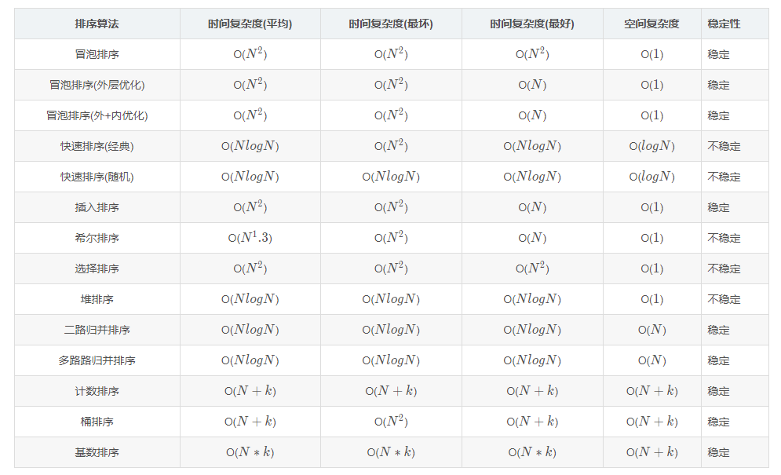
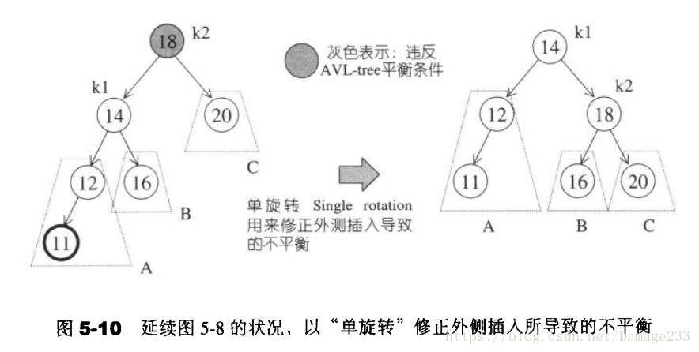
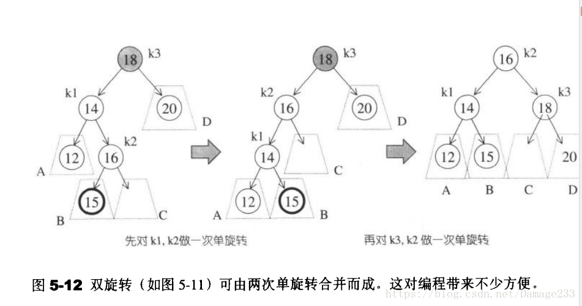

* 排序
    
  * 冒泡排序
    ```
    void BubbleSort(vector<int> &nums)
    {
        //记录位置，当前所在位置和最后发生交换的地方
        int current,last = len - 1;
        while(last > 0)
        {
            for(int i = current = 0;i < last;++i)
            {
                if(nums[i] > nums[i+1])
                {
                    int tmp = nums[i];
                    nums[i] = nums[i+1];
                    nums[i+1] = tmp;
                    //记录当前的位置，如果没有发生交换current值即for循环初始化的0
                    current = i;
                }
            }
            //若current = 0即已经没有可以交换的元素了，即已经有序了
            last = current;
        }
    }
    ```
  * 插入排序
    ```
    void InsertSort(vector<int> &nums)
    {
        for(int i = 1; i < nums.size(); ++i)
        {
            for(int j = i; j > 0; --j){
                if(nums[j] < nums[j - 1])
                {
                    int tmp = nums[j];
                    nums[j] = nums[j-1];
                    nums[j-1] = tmp;
                }
            }
        }
    }
    ```
  * 选择排序
    ```
    void SelectSort(vector<int> & nums)
    {
        int i;
        for(i = 0; i < nums.size() - 1; i++)
        {   
            int minIndex = i;
            for(int j = i; j < nums.size() - 1; j++)
                if(nums[minIndex] > nums[j])
                    minIndex = j;
        }
        swap(nums[minIndex], nums[i]);
    }
    ```
  * 归并排序
    ```
    void MergeSort(vector<int> &nums)
    {
    	vector<int> copy = nums;
	    MergeSortRecursive(nums, copy, 0, nums.size() - 1);
    }

    void MergeSortRecursive(vector<int> &nums, std::vector<int> &copy, size_t start, size_t end)
    {
	    if (start >= end) return;
	    int mid = (end - start + 1) / 2 + start;
	    MergeSortRecursive(nums, copy, start, mid - 1);
	    MergeSortRecursive(nums, copy, mid, end);
	    int start1 = start, start2 = mid, counter = start;
	    while (start1 <= mid - 1 && start2 <= end)
            nums[counter++] = copy[start1] < copy[start2] ? copy[start1++] : copy[start2++];
        while (start2 <= end)
		    nums[counter++] = copy[start2++];
	    while (start1 <= mid - 1)
            nums[counter++] = copy[start1++];
        copy = nums;
    }
    ```
  * 快速排序
    ```
    void QuickSort(vector<int> &nums)
    {
    	QuickSortRecursive(nums, 0, nums.size() - 1);
    }

    void QuickSortRecursive(vector<int> &nums, int start, int end)
    {
        if (start >= end)
            return;
        int pivot_element = nums[(rand() % (end - start + 1)) + a];
        int flag = start;
        for (int j = start; j <= end - 1; j++)
	    {
            if (nums[j] < pivot_element)
	            std::swap(nums[flag++], nums[j]);
	    }
	    std::swap(nums[flag], nums[end]);
	    QuickSortRecursive(nums, start, flag - 1);
	    QuickSortRecursive(nums, flag + 1, end);
    }
    ```
  * 桶排序
  * 堆排序
* 二叉搜索树  
  定义：任何节点的键值一定大于其左子树中的每一个节点的键值，并小于其右子树中的每一个节点的键值。  
  插入：从根节点开始，遇到键值较大向右，遇到键值较小向左，直到尾端，即插入点。  
  删除：  
  1.若是叶子节点直接删除，修改父节点的指针。  
  2.若只有一个子节点，直接将其子节点连至其父节点。  
  3.若有两个子节点，以右子树中的最小值取而代之。  
* AVL树  
  定义：AVL树是一个“加上额外平衡条件”的二叉搜索树。AVL树要求任何节点的左右子树高度相差最多为1。  
  单旋转：  
    
  双旋转：  
    
* 红黑树
* B\B+树
* 哈希表