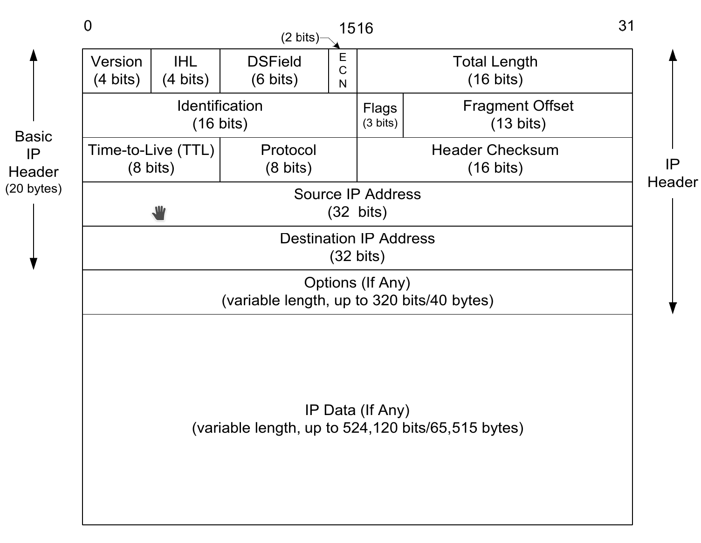
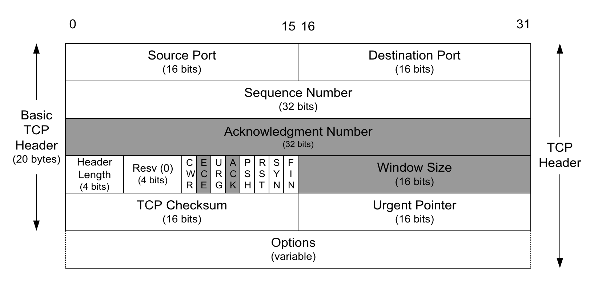
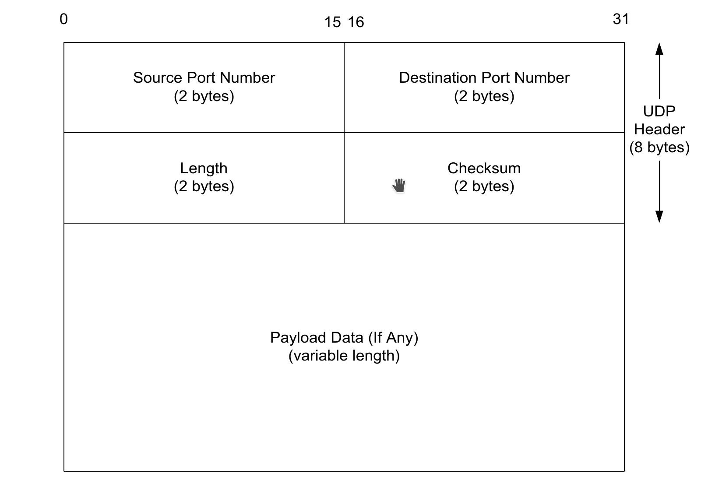
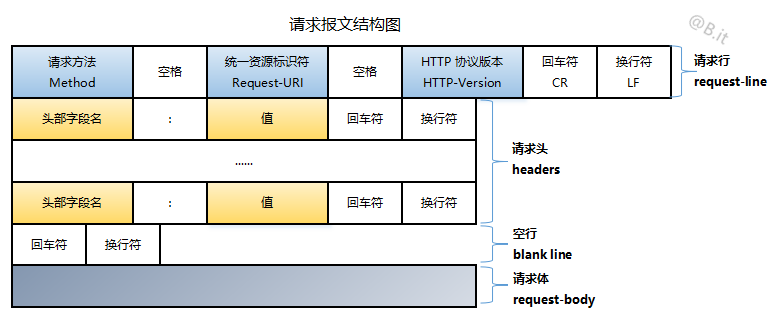
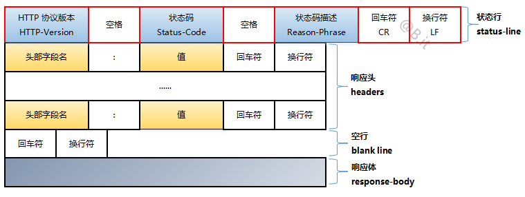

>OSI七层模型：  
>* 应用层(Application layer)  
> 进行数据的发送与接受与数据的处理。
>* 表示层(Presentation layer)  
> 对将要发送的数据进行编码和对接收的数据进行解码。
>* 会话层(Session layer)  
> 建立、管理、终止应用程序之间的连接。
>* 传输层(Transport layer)  
> 对将要发送的数据进行分块、打包和对接受的数据进行合并处理。
>* 网络层(Network layer)  
> 对待传输的数据进行选路和推送。
>* 链路层(Link layer)  
> 将数据包转换为比特流从而提供给物理层和将物理层的比特流转换为数据包。
>* 物理层(Physical layer)  
> 比特流的物理载体。
> >以工厂A要向商户B寄送一批家具为例子：  
> >* 应用层：  
> >寄送家具这项服务所位于的位置即在应用层，它只负责寄送家具到指定的地点，不关注这批家具的用途。
> >* 表示层：  
> >表示层的功能类似于将家具拆分成易于能够进行运输的零部件，以及将接收到的零部件组装成家具。  
> >* 会话层：  
> >会话层的功能类似于记录这次寄送家具的服务何时开始何时结束。
> >* 传输层：  
> >传输层的功能类似于将这批零部件打包成多个包裹分批次的寄出，以及将接收到的包裹拆包并派送到指定的地点。 
> >* 网络层：  
> >网络层的功能类似于选定运输包裹的路线。
> >* 链路层：  
> >链路层的功能类似于将包裹进行装卸使得运输工具可以装载。例如用轮船作为运输工具就需要将包裹装入集装箱。  
> >* 物理层：  
> >物理层类似于运输包裹的运输工具。例如轮船、卡车、飞机。  
# 网络层 
* IP
  >  
  * 
* RIP  
* BGP
* ARP
  >不管网络层使用的是什么协议，在实际网络链路上传送数据帧时，最终还是必须使用硬件地址。 因为网络接口只识别48位硬件地址,无法识别32位IP地址。所以需要ARP协议将IP地址转换为物理地址。  
  >ARP工作流程：  
  >1. 根据主机A上的路由表内容，IP确定用于访问主机B的转发IP地址是192.168.1.2。然后A主机在自己的本地ARP缓存中检查主机B的匹配MAC地址。  
  >2. 如果主机A在ARP缓存中没有找到映射，它将询问192.168.1.2的硬件地址，从而将ARP请求帧广播到本地网络上的所有主机。源主机A的IP地址和MAC地址都包括在ARP请求中。本地网络上的每台主机都接收到ARP请求并且检查是否与自己的IP地址匹配。如果主机发现请求的IP地址与自己的IP地址不匹配，它将丢弃ARP请求。  
  >3. 主机B确定ARP请求中的IP地址与自己的IP地址匹配，则将主机A的IP地址和MAC地址映射添加到本地ARP缓存中。  
  >4. 主机B将包含其MAC地址的ARP回复消息直接发送回主机A。  
  >5. 当主机A收到从主机B发来的ARP回复消息时，会用主机B的IP和MAC地址映射更新ARP缓存。本机缓存是有生存期的，生存期结束后，将再次重复上面的过程。主机B的MAC地址一旦确定，主机A就能向主机B发送IP数据报了。  
* RARP  
  >ARP是设备通过自己知道的IP地址来获得自己不知道的物理地址的协议。假如一个设备不知道它自己的IP地址，但是知道自己的物理地址，例如无盘主机，设备知道的只是网络接口卡上的物理地址,这时就需要RARP协议通过物理地址获取IP地址。  
  >工作流程：  
  >1. 发送主机发送一个局域网内的RARP广播，在此广播包中，声明自己的MAC地址并且请求任何收到此请求的RARP服务器分配一个IP地址。  
  >2. 本地网段上的RARP服务器收到此请求后，检查其RARP列表，查找该MAC地址对应的IP地址。  
  >3. 如果存在，RARP服务器就给源主机发送一个响应数据包并将此IP地址提供给对方主机使用。  
  >4. 如果不存在，RARP服务器对此不做任何的响应。  
  >5. 源主机收到从RARP服务器的响应信息，就利用得到的IP地址进行通讯；如果一直没有收到RARP服务器的响应信息，表示初始化失败。  
* ICMP  
  >在IP通信中，经常有数据包到达不了对方的情况。原因是，在通信途中的某处的一个路由器由于不能处理所有的数据包，就将数据包一个一个丢弃了。或者，虽然到达了对方，但是由于搞错了端口号，服务器软件可能不能接受它。这时，在错误发生的现场，为了联络而飞过来的信鸽就是ICMP报文(Internet Control Message Protocol)。ICMP报文作为IP数据报的数据，加上IP数据报的首部，组成IP数据报发送出去。  

  
* IGMP
# 传输层
* UDP与TCP的区别  
  >UDP是一种简单的面向数据包的传输层协议，只简单的中转应用层与网络层的数据。使用UDP传输数据可能会导致数据丢失，数据乱序等问题。TCP的出现得以解决这些问题，TCP相当于在UDP的基础上作加法。TCP保证数据按序到达，TCP是面向连接的，TCP具有数据重传等功能。一般情况下程序都会使用TCP作为传输层协议，只有当程序对TCP提供的功能没有需求或对UDP的高性能有需求的情况下使用UDP作为传输层协议。
* TCP报头  
  >  
  >* 目标端口（16bits）与源端口（16bits）：  
  用来识别发送和接收应用程序。  
  >* 序列号（32bits）：  
  用来识别数据传输字节流中的字节。当连接建立时，主机将设置一个初始序列号（ISN），之后每次发送数据，序列号 = ISN + 数据在字节流中的偏移。例如：ISN为1024，第一段数据为512，则第二段数据的序列号为1024 + 512。  
  >* 确认号（32bits）：  
  用来表示下一次收到的数据的序列号，确认号 = 上次收到的序列号 + 1。  
  >* 报头长度（4bits）：  
  用来表示TCP报头的长度 = 报头长度 * 4字节，则TCP报头最长为15 * 4 = 60字节。  
  >* 保留位（6bits）：  
  TCP报头中的保留位一般设置为0，用以未来增加功能，个人猜测是用来填充为32bits的整数倍。  
  >* 标志位（6bits）：  
  标志位的六个bits分别代表六个标志位，从低到高依次为：  
      1. URG：  
      URG位为1时，表示紧急指针位有效。  
      1. ACK：  
      ACK位为1时，表示确认号有效。  
      1. PSH：  
      接收方需要尽快的将数据传送到应用程序。  
      1. RST：  
      重置连接。  
      1. SYN：   
      同步序列号从而建立连接。  
      1. FIN： 
      发送方完成数据的发送。  
  >* 窗口大小（16bits）：   
  用来表示窗口大小，窗口用来实现TCP的流量控制功能。  
  >* 校验和（16bits）：  
  用来校验TCP报头与TCP数据的正确性。由发送方计算，接收方验证。  
  >* 紧急指针（16bits）：  
  紧急指针为一个正向偏移量，与序列号相加得到紧急数据的最后一个字节的序列号。
  >* TCP选项位
* UDP报头  
  >  
  >* 目标端口（16bits）与源端口（16bits）：  
  用来识别发送和接收应用程序。  
  >* UDP长度（16bits）：  
  用来表示UDP报头加上UDP数据的长度 = UDP长度 * 1字节。  
  >* 校验和（16bits）：  
  用来校验UDP报头与UDP数据的正确性。由发送方计算，接收方验证。   
* TCP三次握手  
   >1. 客户端发送一个SYN位为1的段，指出客户端的初始序列号（ISN）。
   >2. 服务端回应一个ACK、SYN位为1的段，指出服务端的初始序列号（ISN）并确认客户端的SYN段。
   >3. 客户端回应一个ACK位为1的段，确认服务端的SYN段。
* TCP四次挥手  
  >1. 客户端发送一个FIN位为1的段，表明客户端向服务端的数据传输已经终止。
  >2. 服务端回应一个ACK位为1的段，确认客户端的FIN段。
  >3. 服务端发送一个FIN位为1的段，表明服务端向客户端的数据传输已经终止。
  >4. 客户端回应一个ACK位为1的段，确认服务端的FIN段。
* 三次握手四次挥手的原因  
  >三次握手：连接的成功建立需要使客户端知道服务端能够接收和发送数据，服务端知道客户端能够接受和发送数据。第一次握手使得服务端知道客户端能够发送数据，第二次握手使得客户端知道服务端能够发送和接收数据，第三次握手使得服务端知道客户端能够接受数据。  
  >四次挥手：TCP为全双工通信，要想完全断开连接，需要断开服务端到客户端的数据传输，以及客户端到服务端的数据传输。第二次与第三次挥手有时可以合并。
* TCP半关闭
  >由于TCP是全双工通信，所以我们可以只断开一个方向的数据传输而保持相反方向的数据传输。
* TCP连接状态  
  >  
  >* CLOSED：  
  初始状态，表示TCP连接是“关闭着的”或“未打开的”。  
  >* LISTEN：  
  表示服务器端的某个SOCKET处于监听状态，可以接受客户端的连接。  
  >* SYN_SEND：  
  客户端主动连接，发送SYN段，进入此状态。  
  >* SYN_RECV：  
  服务端被动连接，收到SYN段并发送服务端SYN段，进入此状态。  
  >* ESTABLISH：  
  表示连接建立。客户端发送了最后一个ACK段后进入此状态，服务端接收到ACK段后进入此状态。  
  >* FIN_WAIT_1：  
  主动终止连接的一方发送了FIN段后进入。等待对方的FIN段。  
  >* CLOSE_WAIT：  
  被动终止连接的一方接收到FIN段之后等待关闭的阶段。在接收到对方的FIN段之后回复ACK段的，表示已经知道对方关闭数据传输。但是本方是否关闭数据传输取决于是否还有数据需要发送给对方，在本方发送FIN段之前均为此状态。  
  >* FIN_WAIT_2：  
  主动终止连接的一方收到对方的ACK段，此时为半关闭状态，本方已经关闭数据传输，等待对方关闭。但并没有立即接收到对方的FIN段，进入此状态。  
  >* LAST_ACK：  
  被动终止连接的一方发送FIN段，等待最后的ACK响应，进入此状态。  
  >* TIME_WAIT：  
  主动断开连接方发送完最后一个ACK段时进入此状态而不是进入CLOSED状态。一是为了使一旦最后一个ACK段丢失后对方重发FIN段后主动断开连接方依然可以回复ACK段。二是如果不进入TIME_WAIT状态主动断开连接方以和旧连接相同的四元组建立新的连接，而此时旧连接滞留在网络中的数据段到达新连接从而造成序列号不匹配的问题。TIME_WAIT一般维持2MSL的时间。
* TCP超时重传
  >* RTT：  
  RTT（Round Trip Time）为发送数据到接收到确认之间的时间间隔，即数据在网络中的往返时间。TCP可以用Timestamp选项计算每个被确认的TCP段的RTT。  
  >* RTO：  
  RTO（Retransmission Time Out）当发送数据后经过了RTO时间还未收到确认将重传数据。RTO由系统根据RTT进行计算，计算RTO的值应当尽可能的预测网络状况考虑网络波动。RTO的值由平滑RTT与平滑RTT平均偏差有关，平滑的意思是新值的一部分由就值决定。    
  >* Karn算法：  
  Karn算法大意为：当发送的数据段超时重传后，就不使用该数据段的RTT作为样本计算RTO。因为当数据段重传后收到的确认段可能是对之前超时数据段的确认，也可能是对重传数据段的确认，所以这个数据段的RTT不具有参考价值。  
  但这又引出另外的问题，比如当网络延时突然增大，此时数据段会进行重传，但由于Karn算法，此次RTT不作参考，这样会导致RTO无法更新。所以对Karn算法进行修正：每次发生重传都将RTO增大，一般为将RTO置为原RTO的两倍，当不发生重传后再正常计算RTO。   
* 延时ACK  
  >当接收方收到发送方的数据时不会立即回复ACK段，而是等待一定时间（最大一般为200ms）如果接收方此时有数据要发送那么就可以在发送的数据段内捎带上ACK信息，或者又接收到了放送方的数据那么就可以合并两个ACK信息。捎带ACK相比直接发送ACK段要节省40字节的TCP报头与IP报头，所以延时ACK可以提高网络吞吐量。 
* Nagle算法  
  >Nagle算法大意为：当TCP连接中有未被确认的数据段时，小于MSS大小的数据段将被放置于等待队列，直到收到确认段。  
  >优点：通过减少数据包的发送量，从而提高网络吞吐量。因为每次发送数据都会加上40字节的TCP报头和IP报头，若数据本身较小则效率比较低。  
  >缺点：会降低实时性，典型的例子为：当发送方不断的进行小数据段的“写写读”操作时，由于Nagle算法与延时ACK此时会大幅增加延时。如果非常重视实时性，可以使用TCP_NODELAY选项关闭Nagle算法。  
* TCP流量控制  
  >原因：TCP会在操作系统内核中为每个连接维护一个接收缓冲区，当收到正确的数据时会将数据存储在缓冲区中，等待进程读取数据。但是当接受方读取数据的速度较慢，而发送方发送数据的速度较快，那么就会造成缓冲区溢出，此时发送方再发送的数据会被接收方丢弃。为了避免这样的问题，TCP提供流量控制机制，避免缓冲区溢出。  
  >机制：TCP使用滑动窗口进行流量控制。在建立TCP连接时双方会在TCP报头中指出自己的窗口大小。接收方接受到数据但进程并未从缓冲区读取数据时，接收方减少相应字节的窗口大小（即窗口左边缘右移），并在ACK段中告诉发送方减少后的窗口大小。当接受方的进程从缓冲区读取一部分数据后，接收方增大窗口大小（即窗口右边缘右移），并在ACK段中告诉发送方增大后的窗口大小。当发送方发现接收方的窗口大小为0时，便停止数据的发送，直到窗口大小增大。接收方也可以减少自己的最大窗口大小（即窗口右边缘左移）但RFC强烈不建议这样做！
  >>糊涂窗口综合症：如果接收方只通知一个小窗口，那么发送方就只能按照这个窗口大小发送少量的数据，如果发送的数据过小那么TCP传输效率就会变低。TCP用以下措施避免这种情况的发生：接收方只在窗口大小为一个MSS或最大窗口大小一半时再进行通知；对于发送方，除了考虑对方窗口大小（一个MSS或最大窗口大小的一半）外，当发送方没有未被确认的数据段或者Nagle算法关闭时也会直接发送数据段。
* TCP拥塞控制
  >什么是网络拥塞？在网络中有很多的路由器，路由器也有自己的接收缓冲区。当数据包到达时，被存储在缓冲区中等待路由器处理。当路由器接受到的数据包太多，此时就会发生拥塞。新到达的数据包在缓冲区中等待会消耗大量的时间，这也是网络延迟增加的主要原因。如果路由器的接受速度超过处理数据的速度，此时新到达的数据包会被丢弃，造成大量的丢包。  
  >TCP的拥塞控制分为两部分  
  >>* 慢开始&拥塞避免：  
  >>  发送方维护一个拥塞窗口变量（cwnd）与慢开始门限（ssthresh），cwnd默认为1数据段、sstresh默认为16数据段。  
  >>  慢开始阶段（cwnd < ssthresh）：发送方每次发送不超过cwnd个数据段，当所有发送的数据段都被确认后将cwnd翻倍。  
  >>  拥塞避免阶段（cwnd > ssthresh）：此时当所有发送的数据都被确认后仅将cwnd+1，一旦发生拥塞（超时或收到重复ACK段）sstresh = max ( 2 , cwnd / 2 )，当发生超时的时候cwnd = 1，当接收到3个重复ACK段时cwnd = sstresh / 2 + 3。  
  >>* 快重传&快恢复：  
  >> 快重传：当接收方接收到一个乱序数据段时，立即发送一个重复ACK段也就是上一次发送的ACK段，此ACK段不会被延时发送。当发送方接收到一个重复ACK段时，接收方并不确定这是因为丢包还是序列号乱序导致的，但一旦接收方连续收到3个重复ACK段时，可以大概率确定发生了丢包，此时不用等待重传计时器超时，立即对丢失的数据段进行重传。  
  >> 快恢复：当接收方收到3个重复ACK段时，此时的拥塞没有发生超时的时候严重，便不用再进行慢开始（即cwnd = 1），而是将sstresh = max ( 2 , cwnd / 2 );cwnd = sstresh / 2 + 3。加3是因为，既然已经收到3个重复ACK段这就表明已经有3个数据段被对方接受并丢弃，但这3个数据段因为没有被确认依旧占用这拥塞窗口的大小，所以将拥塞窗口加3进行补偿。 
* 拥塞控制与流量控制
  >* 本质上两者都是对流量进行限制，只不过前者限制的是发送数据的流量，后者限制的是接收数据的流量。
  >* 流量控制主要由双方的接收缓冲区大小决定，而拥塞控制则由网络状况决定。
  >* 最终的限制大小为两者共同作用下的结果。
* TCP定时器
  >* 连接建立定时器：  
  在建立连接发送SYN段后TCP启动一个定时器，当定时器超时后重传SYN段并启动一个新的定时器将时间增加，一定次数的重传后将终止连接。
  >* 重传定时器：  
  TCP在发送数据段之后启动一个重传定时器，当定时器超时后重传数据段并启动一个新的定时器将时间增加，一定次数的重传后将终止连接。
  >* 延时ACK定时器：  
  在收到数据段时TCP启动一个延时ACK定时器，若定时器超时后ACK段依然没有被捎待发送便独立发送ACK段。  
  >* 坚持定时器：  
  当接受方的窗口关闭后一旦窗口打开，那么接收方会单独发送一个ACK段通知发送方窗口已经打开。然而一旦此ACK段丢失，发送方会等待对方窗口打开的通知，接收方会等待对方的数据，此时就会陷入死锁。  
  为了避免这种情况的发生，当发送方被通知对方的窗口已经关闭，便会启动一个坚持定时器。当定时器超时后发送方会向对方发送一个探测报文（一个只含一字节数据的数据段）探测对方的窗口是否仍未打开。如果已经打开就关闭此定时器，如果仍未打开就启动一个新的定时器将时间增加。坚持定时器会一直存在直到对方发送窗口打开的通知或连接关闭。  
  >* 保活定时器：  
  用来检测对方是否还能收到数据。当用户开启了SO_KEEPLIVE选项后，TCP启动一个保活定时器，每当双方发生数据交互时保活定时器重置，当定时器超时后向对方发送探测报文，一定时间后对方如果没有回复就再发一个，一定次数后TCP认为对方已经失去响应，便关闭此连接。
  >* FIN_WAIT_2定时器：  
  当一方主动关闭连接（非半关闭）并收到第一个ACK进入FIN_WAIT_2状态后，TCP启动一个FIN_WAIT_2定时器，如果定时器超时后依然没有收到对方的FIN段，主动关闭连接的一方将直接进入CLOSED状态放弃此连接。
  >* TIME_WAIT定时器：  
  当主动断开连接方进入TIME_WAIT状态后TCP便启动一个TIME_WAIT定时器，定时器超时前如果再次收到对方的FIN段就重置此定时器，定时器超时后便离开TIME_WAIT状态。 
* TCP可靠传输  
  >* 建立连接：  
  在通信前建立连接，确保通信双方可以向对方放送数据和接收对方的数据。
  >* 序列号：  
  确保数据是按序到达的。
  >* 确认号：  
  确保数据完整到达与确保对方收到数据。  
  >* 数据校验：  
  确保数据的正确。  
  >* 超时重传：  
  确保未能到达的数据段被重新发送。  
  >* 窗口机制：  
  对发送与接收的流量设置一定的瓶颈。
# 应用层
### HTTP
>* 请求报文  
>  
>   * 请求方法：  
>   GET：向服务器发出请求希望获取url指定的资源（HTML文本、图片、视频等）。  
>   POST：向指定资源提交数据进行处理，提交的数据被包含在请求体中（表单数据提交、文件上传等）。    
>   HEAD：与GET类似但是不希望获得具体的资源（响应体），只希望获得状态行与响应头。可以用来测试资源能否获得。  
>   PUT：请求向服务器上传资源到url指定的位置。  
>   GET：请求获得服务器上url指定的资源。  
>   ... ...  
>   * 请求头：  
>   Accept-Language：表示希望接受的语言。  
>   User-Agent：表示自己的操作系统、浏览器名称版本等待。  
>   Connection：表示长连接还是短连接。  
>   ... ...  
>   * 请求体：  
>   可能时POST方法的键值参数也可能时PUT方式的资源，等等。  
>* 响应报文  
>  
>   * 状态码：  
>   状态代码由三位数字组成，第一个数字定义了响应的类别，且有五种可能取值：  
>   1xx：指示信息--表示请求已接收，继续处理。  
>   2xx：成功--表示请求已被成功接收、理解、接受。  
>   3xx：重定向--要完成请求必须进行更进一步的操作。  
>   4xx：客户端错误--请求有语法错误或请求无法实现。  
>   5xx：服务器端错误--服务器未能实现合法的请求。  
>   常用状态码：
>   200 OK：成功返回状态，对应，GET,PUT,PATCH,DELETE。  
>   201 created：成功创建。  
>   302 Found：重定向，新的URL会在response中的Location中返回，浏览器将会使用新的URL发出新的Request。  
>   304 Not Modified：代表上次的文档已经被缓存了，还可以继续使用。  
>   400 bad request   - 请求格式错误。  
>   401 unauthorized   - 未授权。  
>   403 forbidden   - 鉴权成功，但是该用户没有权限。  
>   404 not found - 请求的资源不存在。  
>   405 method not allowed - 该http方法不被允许。  
>   410 gone - 这个url对应的资源现在不可用。  
>   415 unsupported media type - 请求类型错误。  
>   422 unprocessable entity - 校验错误时用。  
>   429 too many request - 请求过多。  
>   500 Internal Server Error：服务器发生了不可预期的错误。  
>   503 Server Unavailable：服务器当前不能处理客户端的请求，一段时间后可能恢复正常。 
>   ... ... 
>   * 响应头：  
>   Date：表示信息发送的时间。  
>   Server：Web服务器用来处理请求的软件信息。  
>   Content-Encoding：Web服务器表明了自己用什么压缩方法压缩对象。  
>   Content-Length：服务器告知浏览器自己响应的对象长度。  
>   Content-Type：告知浏览器响应对象类型。  
>   ... ...  
>   * 响应体：  
>   实际有效数据，通常是HTML格式的文件，该文件被浏览器获取到之后解析呈现在浏览器中。  
>* CGI   
>CGI是Web服务器运行时外部程序的规范,按CGI编写的程序可以扩展服务器功能，使得服务器为客户端提供动态服务。  
>例如：客户端通过GET方法指定url为"http:127.0.0.1:80/cgi-bin/test?a=1&b=2&c=3"向服务器发出请求。服务器接受到请求后fork子进程并以"/cgi-bin/test"为路径执行程序，'?'之后的a=1&b=2&c=3为环境变量，子进程的执行结果被转换为html文档发送给客户端。  
>* Cookie  
>由于HTTP协议是无状态的，而服务器端的业务必须是要有状态的。Cookie诞生的最初目的是为了存储状态信息，以方便服务器端使用。  
>例如：在无状态的情况下，用户通过浏览器访问一个电商网站，网站要求用户先进行登录。由于HTTP是无状态的，那么用户的登录状态并不会被保存。如果接下来用户进行一个购买操作需要用户在登录状态下才能进行，那么用户就需要再次进行登录。在支持Cookie的情况下，用户的登录状态就能够被保存，不用多次登录。  
>Cookie的工作流程：  
>   * 服务器像客户端发送Cookie。  
>   * 浏览器将Cookie保存。  
>   * 之后每次http请求浏览器都会将Cookie发送给服务器端。  
>   * 会话Cookie存储在内存中，关闭浏览器自动销毁。  
>   * 持久Cookie存储在磁盘中，可供多个浏览器持续使用。  
>* Session  
>Session也是一种保持HTTP状态的技术，与Cookie不同之处在于Cookie存储在客户端上而Session存储在服务器上，可以保存在数据库、文件或内存中，每个用户有独立的Session用户在客户端上记录用户的操作。我们可以理解为每个用户有一个独一无二的Session ID作为Session文件的Hash键，通过这个值可以锁定具体的Session结构的数据，这个Session结构中存储了用户操作行为。   
>Session的工作流程：
>* 每次HTTP请求的时候，客户端都会发送相应的Cookie信息到服务端。  
>* 第一次创建Session的时候，服务端会在HTTP协议中告诉客户端，需要在Cookie里面记录一个Session ID  
>* 以后每次请求把这个SessionID发送到服务器，服务器就可以对客户端进行识别。
>* 如果客户端的浏览器禁用了Cookie，会使用一种叫做URL重写的技术来进行会话跟踪，即每次HTTP交互，URL后面都会被附加上一个诸如sid=xxxxx这样的参数，服务端据此来识别用户，这样就可以帮用户完成诸如用户名等信息自动填入的操作了。  