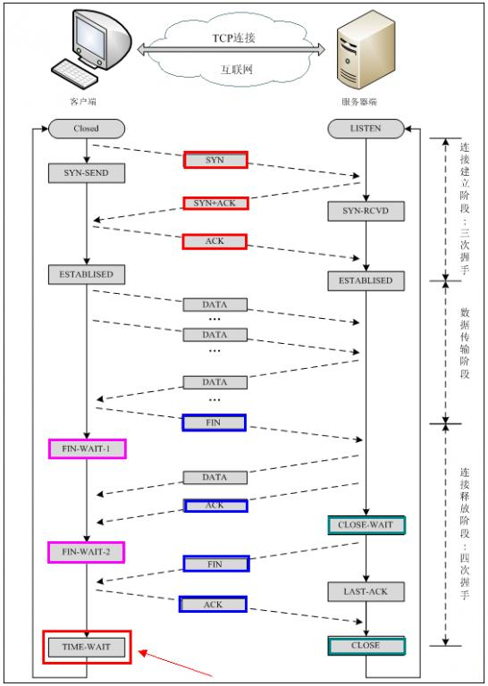

>OSI七层模型：  
>* 应用层(Application layer)  
> 进行数据的发送与接受与数据的处理。
>* 表示层(Presentation layer)  
> 对将要发送的数据进行编码和对接收的数据进行解码。
>* 会话层(Session layer)  
> 建立、管理、终止应用程序之间的连接。
>* 传输层(Transport layer)  
> 对将要发送的数据进行分块、打包和对接受的数据进行合并处理。
>* 网络层(Network layer)  
> 对待传输的数据进行选路和推送。
>* 链路层(Link layer)  
> 将数据包转换为比特流从而提供给物理层和将物理层的比特流转换为数据包。
>* 物理层(Physical layer)  
> 比特流的物理载体。
> >以工厂A要向商户B寄送一批家具为例子：  
> >* 应用层：  
> >寄送家具这项服务所位于的位置即在应用层，它只负责寄送家具到指定的地点，不关注这批家具的用途。
> >* 表示层：  
> >表示层的功能类似于将家具拆分成易于能够进行运输的零部件，以及将接收到的零部件组装成家具。  
> >* 会话层：  
> >会话层的功能类似于记录这次寄送家具的服务何时开始何时结束。
> >* 传输层：  
> >传输层的功能类似于将这批零部件打包成多个包裹分批次的寄出，以及将接收到的包裹拆包并派送到指定的地点。 
> >* 网络层：  
> >网络层的功能类似于选定运输包裹的路线。
> >* 链路层：  
> >链路层的功能类似于将包裹进行装卸使得运输工具可以装载。例如用轮船作为运输工具就需要将包裹装入集装箱。  
> >* 物理层：  
> >物理层类似于运输包裹的运输工具。例如轮船、卡车、飞机。  
## 网络层 
## 传输层
* UDP与TCP的区别  
  >UDP是一种简单的面向数据包的传输层协议，只简单的中转应用层与网络层的数据。使用UDP传输数据可能会导致数据丢失，数据乱序等问题。TCP的出现得以解决这些问题，TCP相当于在UDP的基础上作加法。TCP保证数据按序到达，TCP是面向连接的，TCP具有数据重传等功能。一般情况下程序都会使用TCP作为传输层协议，只有当程序对TCP提供的功能没有需求或对UDP的高性能有需求的情况下使用UDP作为传输层协议。
* TCP报头  
  >* 目标端口（16bits）与源端口（16bits）：  
  用来识别发送和接收应用程序。  
  >* 序列号（32bits）：  
  用来识别数据传输字节流中的字节。当连接建立时，主机将设置一个初始序列号（ISN），之后每次发送数据，序列号 = ISN + 数据在字节流中的偏移。例如：ISN为1024，第一段数据为512，则第二段数据的序列号为1024 + 512。  
  >* 确认号（32bits）：  
  用来表示下一次收到的数据的序列号，确认号 = 上次收到的序列号 + 1。  
  >* 报头长度（4bits）：  
  用来表示TCP报头的长度 = 报头长度 * 4字节，则TCP报头最长为15 * 4 = 60字节。  
  >* 保留位（6bits）：  
  TCP报头中的保留位一般设置为0，用以未来增加功能，个人猜测是用来填充为32bits的整数倍。  
  >* 标志位（6bits）：  
  标志位的六个bits分别代表六个标志位，从低到高依次为：  
      1. URG：  
      URG位为1时，表示紧急指针位有效。  
      2. ACK：  
      ACK位为1时，表示确认号有效。  
      3. PSH：  
      接收方需要尽快的将数据传送到应用程序。  
      4. RST：  
      重置连接。  
      5. SYN：   
      同步序列号从而建立连接。  
      6. FIN： 
      发送方完成数据的发送。  
  >* 窗口大小（16bits）：   
  用来表示窗口大小，窗口用来实现TCP的流量控制功能。  
  >* 校验和（16bits）：  
  用来校验TCP报头与TCP数据的正确性。由发送方计算，接收方验证。  
  >* 紧急指针（16bits）：  
  紧急指针为一个正向偏移量，与序列号相加得到紧急数据的最后一个字节的序列号。
* UDP报头  
  >* 目标端口（16bits）与源端口（16bits）：  
  用来识别发送和接收应用程序。  
  >* UDP长度（16bits）：  
  用来表示UDP报头加上UDP数据的长度 = UDP长度 * 1字节。  
  >* 校验和（16bits）：  
  用来校验UDP报头与UDP数据的正确性。由发送方计算，接收方验证。   
* TCP三次握手  
   >1. 客户端发送一个SYN位为1的段，指出客户端的初始序列号（ISN）。
   >2. 服务端回应一个ACK、SYN位为1的段，指出服务端的初始序列号（ISN）并确认客户端的SYN段。
   >3. 客户端回应一个ACK位为1的段，确认服务端的SYN段。
* TCP四次挥手  
  >1. 客户端发送一个FIN位为1的段，表明客户端向服务端的数据传输已经终止。
  >2. 服务端回应一个ACK位为1的段，确认客户端的FIN段。
  >3. 服务端发送一个FIN位为1的段，表明服务端向客户端的数据传输已经终止。
  >4. 客户端回应一个ACK位为1的段，确认服务端的FIN段。
* 三次握手四次挥手的原因  
  >三次握手：连接的成功建立需要使客户端知道服务端能够接收和发送数据，服务端知道客户端能够接受和发送数据。第一次握手使得服务端知道客户端能够发送数据，第二次握手使得客户端知道服务端能够发送和接收数据，第三次握手使得服务端知道客户端能够接受数据。  
  >四次挥手：TCP为全双工通信，要想完全断开连接，需要断开服务端到客户端的数据传输，以及客户端到服务端的数据传输。第二次与第三次挥手有时可以合并

* TCP半关闭
  >由于TCP是全双工通信，所以我们可以只断开一个方向的数据传输而保持相反方向的数据传输。
* TCP连接状态  
  >
  >* CLOSED：  
  初始状态，表示TCP连接是“关闭着的”或“未打开的”。  
  >* LISTEN：  
  表示服务器端的某个SOCKET处于监听状态，可以接受客户端的连接。  
  >* SYN_SEND：  
  客户端主动连接，发送SYN段，进入此状态。  
  >* SYN_RECV：  
  服务端被动连接，收到SYN段并发送服务端SYN段，进入此状态。  
  >* ESTABLISH：  
  表示连接建立。客户端发送了最后一个ACK段后进入此状态，服务端接收到ACK段后进入此状态。  
  >* FIN_WAIT_1：  
  主动终止连接的一方发送了FIN段后进入。等待对方的FIN段。  
  >* CLOSE_WAIT：  
  被动终止连接的一方接收到FIN段之后等待关闭的阶段。在接收到对方的FIN段之后回复ACK段的，表示已经知道对方关闭数据传输。但是本方是否关闭数据传输取决于是否还有数据需要发送给对方，在本方发送FIN段之前均为此状态。  
  >* FIN_WAIT_2：  
  主动终止连接的一方收到对方的ACK段，此时为半关闭状态，本方已经关闭数据传输，等待对方关闭。但并没有立即接收到对方的FIN段，进入此状态。  
  >* LAST_ACK：  
  被动终止连接的一方发送FIN段，等待最后的ACK响应，进入此状态。  
  >* TIME_WAIT：  
* TCP定时器
  >
* TCP超时重传
  >* RTT：  
  RTT（Round Trip Time）为发送数据到接收到确认之间的时间间隔，即数据在网络中的往返时间，TCP会不间断的测量RTT。  
  >* RTO：  
  RTO（Retransmission Time Out）当发送数据后经过了RTO时间还未收到确认将重传数据。  
   
* TCP流量控制  
* TCP拥塞控制
* TCP可靠传输  
  >* 建立连接：  
  在通信前建立连接，确保通信双方可以向对方放送数据和接收对方的数据。
  >* 序列号：  
  确保数据是按序到达的。
  >* 确认号：  
  确保数据完整到达与确保对方收到数据。  
  >* 数据校验：  
  确保数据的正确。  
  >* 超时重传：  
  确保未能到达的数据段被重新发送。  

## 应用层
